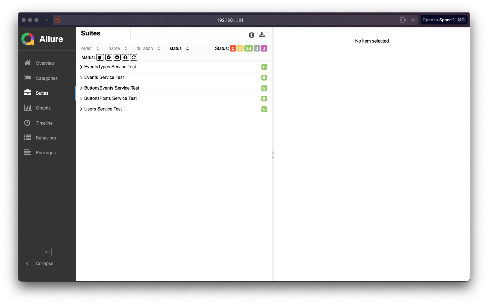
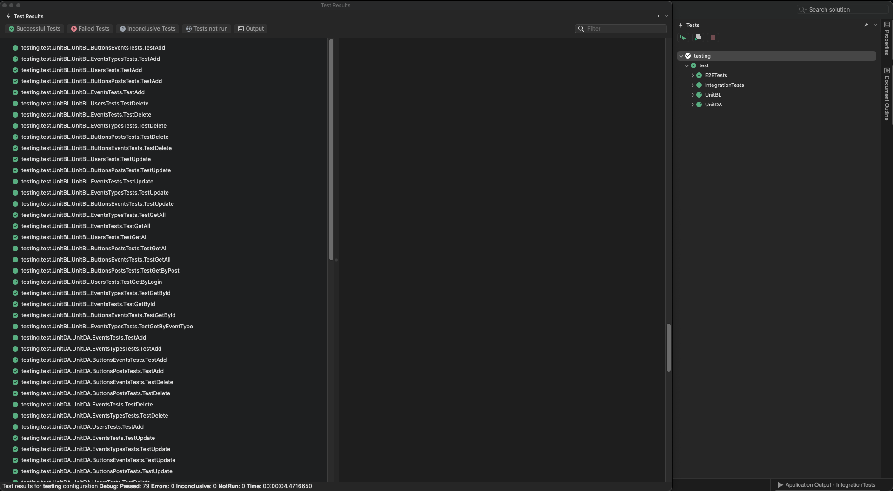
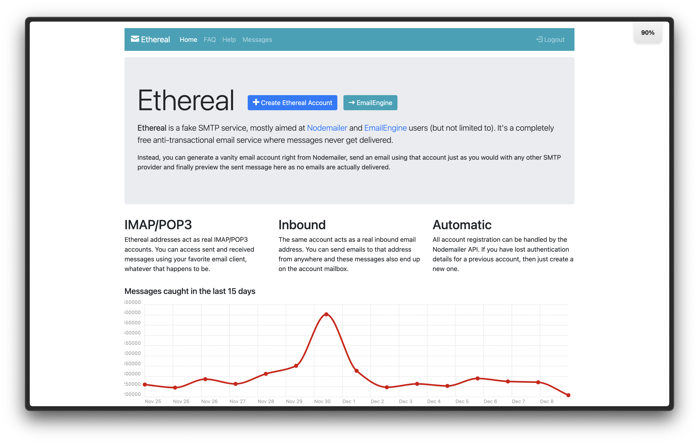
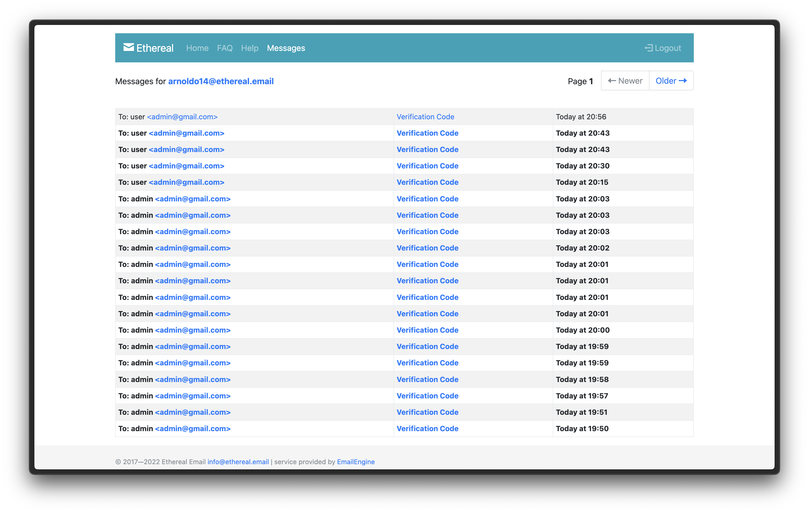
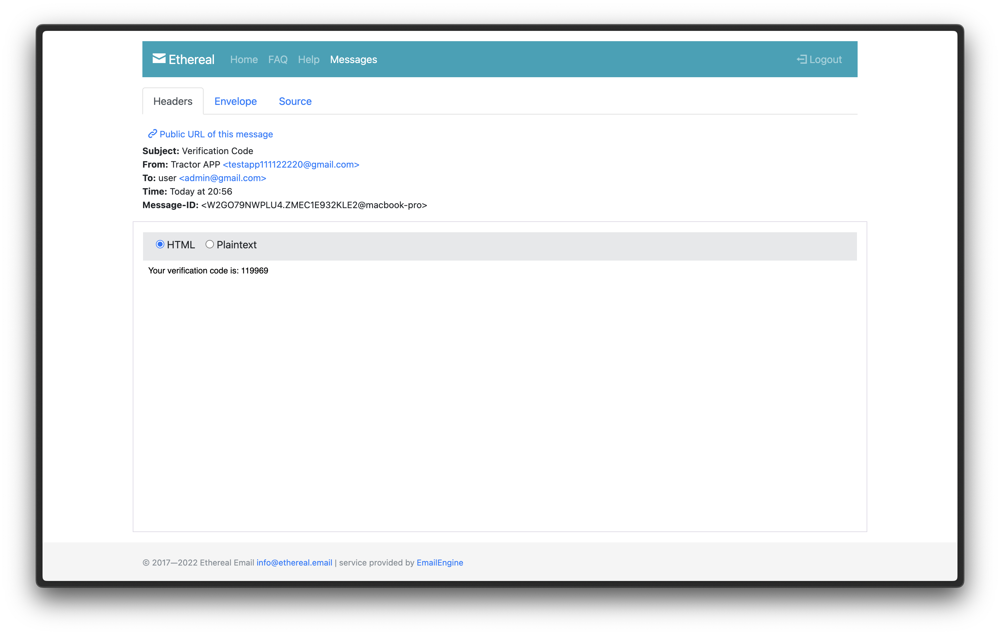
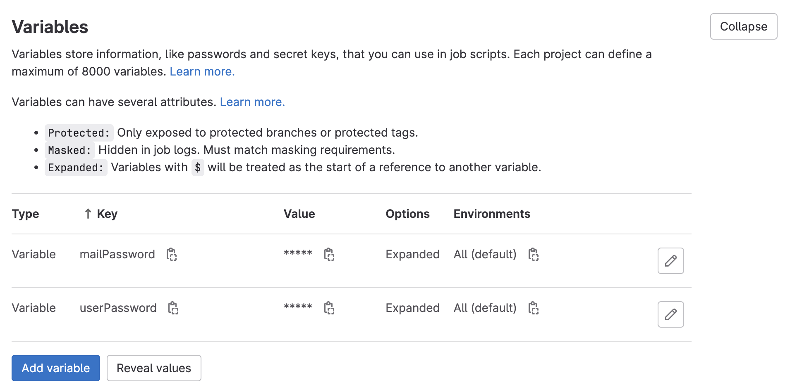
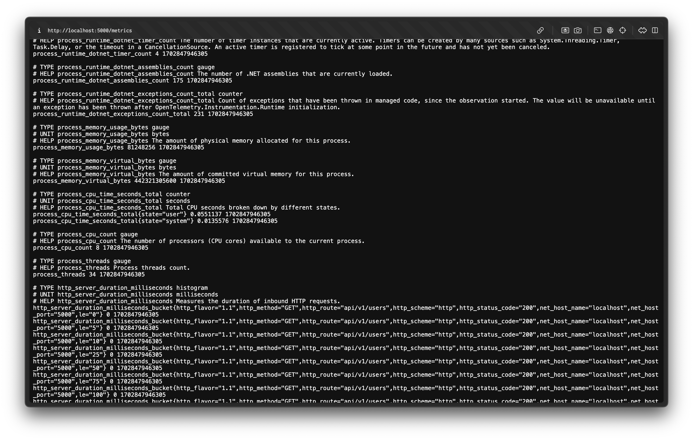
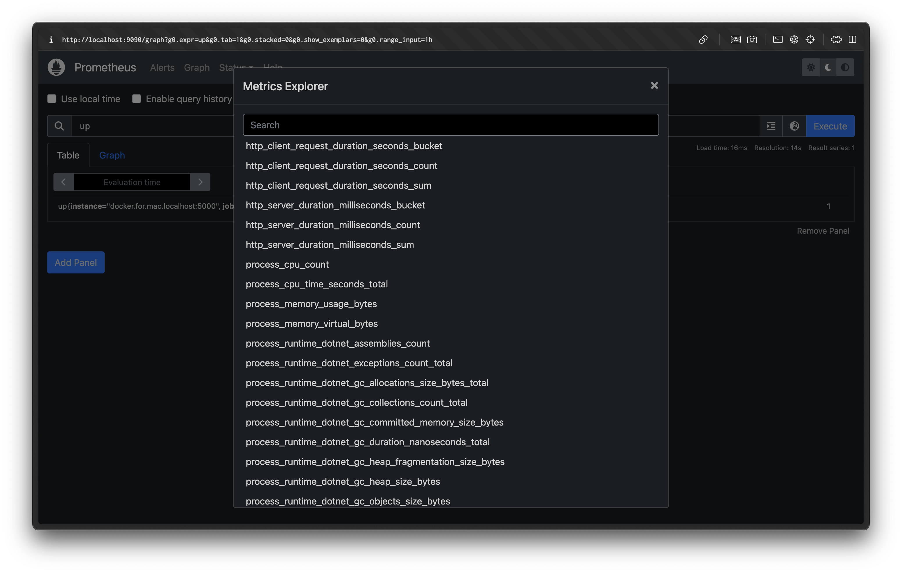
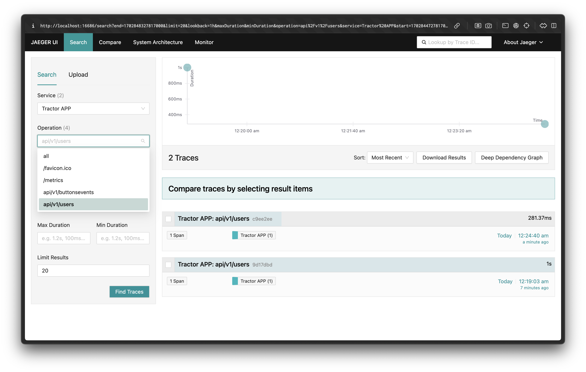

# Lab 1,2

## Тесты

Для изменения порядка тестирования следуйте указанным шагам:

1. Откройте конфигурационный файл `testConfig.json`.

2. В файле `testConfig.json` найдите значение `isRandomOrder` и измените его на `false`, если хотите проводить тестирование в обычном порядке, или на `true`, если хотите запускать тесты в случайном порядке.

   ```json
   {
     "isRandomOrder": false
   }
### Allure




### Все тесты



## Проведение тестов

### UnitDA

Для проведения тестов в проекте `UnitDA` используется временная база данных, поэтому нет необходимости в восстановлении. Для создания контекста базы данных `AppDBContext` в `UnitDA` используется следующий метод:


    namespace UnitDA
    {
        public class ContextCreator
        {
            public static AppDBContext CreateContext()
            {
                var name = "database_" + Guid.NewGuid().ToString();
                var options = new DbContextOptionsBuilder<AppDBContext>()
                    .UseInMemoryDatabase(databaseName: name)
                    .Options;

                return new AppDBContext(options);
            }
        }
    }

### UnitBL

Для тестирования в проекте `UnitBL` используются моки (mocks).

### IntegrationTests и E2ETests

В проектах `IntegrationTests` и `E2ETests` каждому работнику выделяется свой контейнер с базой данных, в которую загружены миграции. Это означает создание полностью пустой базы данных со всеми связями и сущностями. После проведения тестов база данных очищается.

Для настройки контекста базы данных `AppDBContext` в `IntegrationTests` и `E2ETests` используется следующий код:


    var builder = new DbContextOptionsBuilder<AppDBContext>();
    // Deploy
    builder.UseNpgsql("Server=postgres;User ID=postgres;Password=17009839;Port=5432;Database=tractor_plant;");
    // Local
    // builder.UseNpgsql("Server=localhost;User ID=postgres;Password=17009839;Port=5433;Database=tractor_plant;");

    using var context = new AppDBContext(builder.Options);
    await context.Database.MigrateAsync();


# Lab 4

## SMTP Service 

Для тестирование использовал Ethereal



Сообщения от сервера при авторизации



Детальная информация в сообщении



## BDD

Использовал в качестве BDD-фреймворка SpecFlow и писал тесты на основе Gherkin-синтаксиса:

    Feature: Аутентификация пользователей

        Scenario: Аутентификация пользователя
            Given пользователь вводит данные для входа
            When пользователь отправляет запрос на вход в систему с учетными данными
            Then система должна вернуть успешный ответ и отправить код верификации на почту

            Given пользователь вводит полученный код верификации
            When пользователь отправляет запрос на подтверждение кода верификации
            Then система должна вернуть успешный ответ и пользователь авторизуется

К сожалению, в моем проекте не предусмотрена смена пароля самим пользователем, потому что проект считается закрытым и менять пароль может только администратор другим пользователям, хотя в моей системе даже админ не может менять пароли, а только пермишины переставлять и добавлять новых пользователей.

## Gitlab secrets

Использовал gitlab vars для скрытия паролей почты и юзеров




# Lab 5

## Отдача метрик сервером



## Анализ метрик в Prometheus

Prometheus делает опрос сервера по заданному урлу и выкачивает метрики, а потом интерпретирует их в красивом и удобном виде



## Трассировка в Jaeger

В Jaeger можно удобно отслеживать все поступающие запросы на сервер, а также всю детальную информацию о них.

